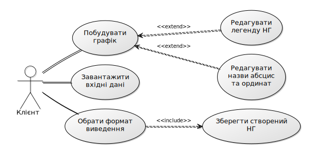

# Технічне завдання
# Project Record

## Зміст

## Терміни та визначення
### Загальні терміни

Програмний продукт (ПО) - програма plot-ewb-graph, вимоги до якого вказані у данному документі.

ВВ - Варіанти Використання або [Use Case][1]. 

ДВВ - Діаграма Варіантів Використання або [Use Case Diagram][2].

ТЗ - Технічне Завдання.

### Технічні терміни

ОС - Операційна Система.

НГ - Наукова Графіка (наочне зображення об'єктів наукових досліджень, графічна обробка результатів розрахунків.

Легенда - розшифровка умовних позначень на НГ.

## Загальні положення
### Призначення документу

У даному документі представленний повний набір вимог до ПО, які необхідно реалізувати.
При реалізації необхідно виконати роботи у повному об'ємі та у вказанний термін, які зазначенні в даному документі.
Всі неточності, виявлені в ТЗ після його утвердження, повинні бути узгоджені.

### Цілі створення програмного продукту

З точки зору клієнтів:

- спростити клієнтам побудову НГ на основі існуючих данних;
- зменшити час на побудову НГ;
- отримати зображення НГ для подальшого використання.

З точки зору розробника ПО:

- реалізація можливості побудови НГ на основі координатних точок;
- інтеграція можливості зчитування координатних точок з текстового файлу;
- реалізація можливості виведення результату у графічному файлі;

###	Основні функціональні можливості програмного продукту

ПО повинен включати наступні основні функціональні можливості:

- введення координатних точок з командної строки;
- зчитування текстового файлу, який містить координатні точки;
- побудова НГ на основі вхідних данних;
- виведення побудованних НГ у командному рядку;
- виведення побудованних НГ у вигляді графічного зображення;
- можливість побудови декількох графіків одночасно.
- зміна назв абсциси та ординати НГ;
- зміна ціни поділки НГ;
- зміна легенди НГ.

### Використання технічного завдання

Розробники ПО повинні виконати усі вимоги, вказані в даному ТЗ та дотриматися термінів здачі готового продукту.

## Функціональні вимоги
### Діаграми варіантів використання

На діаграмах представлені основні ВВ ПО, детальний опис яких можна знайти в п. 3.2 "Опис варіантів використання".

1. ВВ клієнтом

### Опис варіантів використання

#### Опис основних можливостей для клієнтам

- клієнт вводить вхідні данні;
- клієнт зберігає створений НГ.

#### Опис основних можливостей для клієнтам

- клієнт редагує назви абсциси та ординати;
- клієнт редагує ціну поділки;
- клієнт редагує легенду НГ;
- клієнт вибирає формат виведення готового НГ.

### Додаткові функціональні вимоги

- виведення інформації щодо використання команд при введенні команді /help; 
- вибір формату збережння готового НГ;
- підтримка декількох текстових форматів (які обговорюються під час одного з етапів реалізації ПО та вибираються в залежності від можливостей розробників) для вводу даних.

## Нефункціональні вимоги
### Інтерфейс користувача

- система повинна коректно відображатися в будь-якій командній оболочці;
- кодування тексту повинно коректно відображатися в будь-якій командній оболочці;

### Підтримка операційних систем

ПО повинен коректно працювати в наступних операційних системах:
- Widnows XP та вище;
- UNIX-подібні системи.
Для коректної роботи ПО повинна бути відсутня потреба встановлення додаткових програм, файлів, бібліотек тощо.

### Вимоги до продуктивності

- ПО повинен стабільно працювати з великою кількістю координатних точок (більше 40);
- ПО повинен створювати вихідних НГ не більше, ніж 30 секунд;
- ПО повинен створювати декілька вихнідних НГ не більше, ніж 60 секунд.

## Вимоги до прийому та сдачі проекту

Розробник повинен надати наступний комплект документів під час здачі проекту:

- початковий код ПО;
- виконавчі файли;
- тест-план;
- тестові сценарії;
- баг-репорт;
- керівництво користувача.

[1]: https://ru.wikipedia.org/wiki/Use_case "Сценарий использования"
[2]: https://ru.wikipedia.org/wiki/UML "UML"

